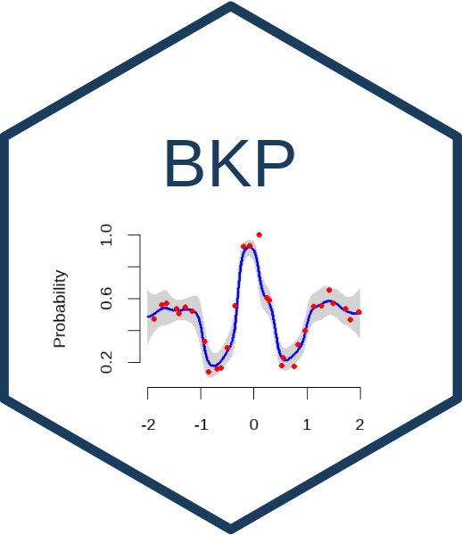
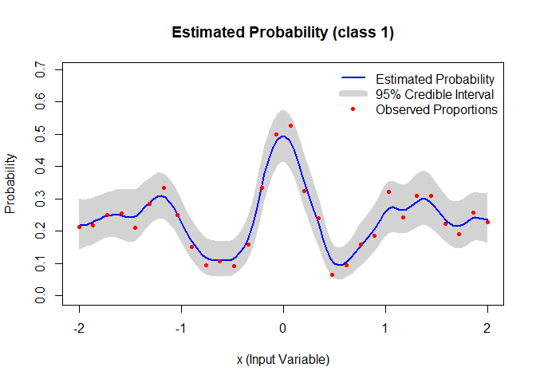
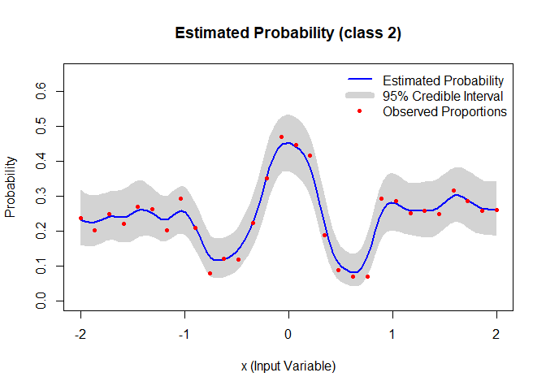
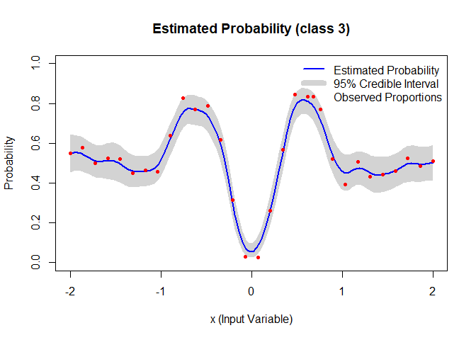

# BKP 

<!-- badges: start -->

[](https://github.com/Jiangyan-Zhao/BKP/actions/workflows/R-CMD-check.yaml)
[](https://app.codecov.io/gh/Jiangyan-Zhao/BKP)
<!-- badges: end -->

The **BKP** package provides scalable Bayesian modeling tools for
binomial and multinomial response data via the **Beta Kernel Process
(BKP)** and its generalization, the **Dirichlet Kernel Process (DKP)**.

- **BKP** is designed for binary (or binomial) outcomes.
- **DKP** extends BKP to handle multi-class responses via
  Dirichlet-multinomial modeling.

Both models leverage kernel-based weighting and conjugate priors to
enable efficient posterior inference, probabilistic prediction, and
uncertainty quantification.

## Installation

Install the development version of the BKP package from GitHub:

``` r
# install.packages("pak")
pak::pak("Jiangyan-Zhao/BKP")
```

## BKP: Binary/Count Response Modeling

### Example

``` r
library(BKP)

# Simulate data
set.seed(123)
n <- 30
Xbounds <- matrix(c(-2, 2), nrow = 1)
x <- matrix(seq(-2, 2, length.out = n), ncol = 1)
true_pi <- (1 + exp(-x^2) * cos(10 * (1 - exp(-x)) / (1 + exp(-x)))) / 2
m <- sample(50:100, n, replace = TRUE)
y <- rbinom(n, size = m, prob = true_pi)

# Fit BKP model
model <- fit.BKP(x, y, m, Xbounds = Xbounds)

# Predict on new data
Xnew <- matrix(seq(-2, 2, length.out = 100), ncol = 1)
pred <- predict(model, Xnew)

# Plot results
plot(model)
```


## DKP: Multi-class Extension

DKP generalizes BKP to multi-class settings using a
Dirichlet-multinomial model.

### Example

``` r
# Simulate 3-class data
set.seed(123)
n <- 30
Xbounds <- matrix(c(-2, 2), nrow = 1)
x <- matrix(seq(-2, 2, length.out = n), ncol = 1)
pi1 <- (1 + exp(-x^2) * cos(10 * (1 - exp(-x)) / (1 + exp(-x)))) / 2
pi_true <- cbind(pi1/2, pi1/2, 1 - pi1)

m <- sample(50:100, n, replace = TRUE)
Y <- t(sapply(1:n, function(i) rmultinom(1, size = m[i], prob = pi_true[i, ])))

# Fit DKP model
model_dkp <- fit.DKP(x, Y, Xbounds = Xbounds)

# Predict on new input
Xnew <- matrix(seq(-2, 2, length.out = 10), ncol = 1)
pred_dkp <- predict(model_dkp, Xnew)

# Plot results
plot(model_dkp)
```



## Features

- ✅ Bayesian modeling for binomial and multinomial count data
- ✅ Kernel-based local information sharing
- ✅ Posterior prediction and uncertainty quantification
- ✅ Class label prediction using threshold or MAP rule
- ✅ Simulation from posterior (Beta or Dirichlet) distributions

## Simulate Posterior Samples

You can simulate posterior samples using:

``` r
# BKP posterior draws
simulate(model, Xnew, n_sim = 5)

# DKP posterior draws
simulate(model_dkp, Xnew, n_sim = 5)
```

## Citing

If you use this package in your work, please cite the accompanying
methodology papers or package documentation.

## Development

The BKP package is under active development. Contributions and
suggestions are welcome via GitHub issues or pull requests.
